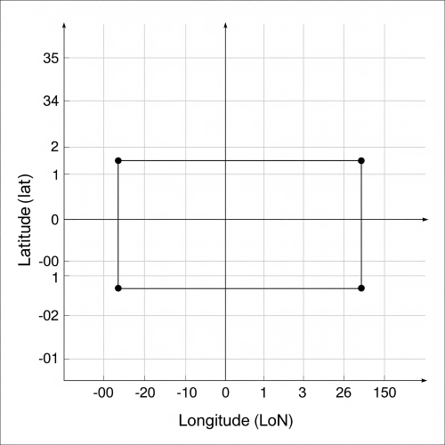
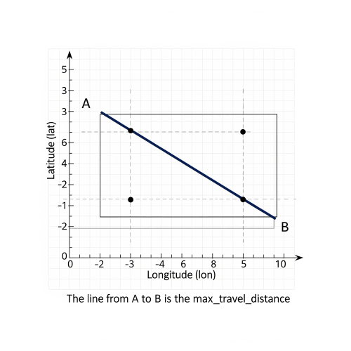

## ES|QL Example

**Query statement:**
```ES|QL
FROM azure_entra_signin_logs
//| WHERE user.name == "user366"
| STATS
    max_lat = MAX(geo.location.lat),
    min_lat = MIN(geo.location.lat),
    max_lon = MAX(geo.location.lon),
    min_lon = MIN(geo.location.lon)
  BY day = DATE_TRUNC(1 day, @timestamp), user.name
| EVAL top_left_corner = TO_GEOPOINT(CONCAT("POINT(", TO_STRING(min_lon), " ", TO_STRING(max_lat), ")"))
| EVAL bottom_right_corner = TO_GEOPOINT(CONCAT("POINT(", TO_STRING(max_lon), " ", TO_STRING(min_lat), ")"))
//Calculate the distance using the explicit POINT() format
| EVAL max_travel_distance = ST_DISTANCE( top_left_corner, bottom_right_corner)
| KEEP user.name, day, max_travel_distance
| SORT user.name, max_travel_distance DESC
```

**1. The Computer Reads Each Card** 🧐

First, the computer looks at every single sign-in record. On each record, it only pays attention to four specific fields:

- user.name: "user162" → This tells us WHO signed in.
- @timestamp: "2024-06-15T..." → This tells us WHEN they signed in.
- geo.location.lat: 40.71... → This is the North/South map coordinate.
- geo.location.lon: -74.00... → This is the East/West map coordinate.

**2. It Sorts the Records into Piles** 🗂️

The computer gets organized. It looks at the user.name and the @timestamp on each record. It creates a separate pile for each person for each day.

For example, it will find all records where user.name is "user162" and the date in @timestamp is June 15th, 2024, and put them all in one pile. It does this for every user for every day.


**3. It Draws an "Activity Box" for Each Pile** 🗺️

Now, the computer looks at one pile at a time, like the pile for "user162 on June 15th". It reads the map coordinates from all the records in that pile:

- It finds the biggest geo.location.lat (the most northern point).
- It finds the smallest geo.location.lat (the most southern point).
- It finds the biggest geo.location.lon (the most eastern point).
- It finds the smallest geo.location.lon (the most western point).

These four points create an invisible box around all of that user's activity for that day.




**4. It Measures the Longest Line in the Box** 📏

To estimate the largest possible distance traveled, the computer measures the longest straight line it can inside the box: the diagonal.

It measures the distance from the top-left corner to the bottom-right corner. This becomes the max_travel_distance.




**5. It Creates a Simple Report** 📝

Finally, the computer shows a clean table with only the important info: the day, the user's name, and the final distance it calculated.

## Transform Example

**walk through the exact flow using the same scenario:**

- **User:** alice@example.com
- **Day:** 2025-06-25
- **Sign-ins:** 5 total documents.
- **Shard Distribution:**
  - **Shard A** holds 3 of Alice's documents.
  - **Shard B** holds the other 2.
- **The Goal:** Find the absolute maximum speed, even if it's between the last sign-in on Shard A and the first sign-in on Shard B.

---

**Phase 1: Intra-Shard Analysis (Within each shard)**

**Step 1 & 2: Collection (``init_script`` & ``map_script``)**

This part is the same as before. The transform runs in parallel on all shards.

- **On Shard A:** A list state.locations is created and populated with 3 of Alice's location data points (timestamp, lat, lon) in no particular order.

- **On Shard B:** A separate list state.locations is created and populated with the other 2 location data points.

```

                   COORDINATOR NODE
                        |
      +-----------------+-----------------+
      |                 |                 |
   SHARD A           SHARD B           SHARD C
(has 3 docs)      (has 2 docs)       (has 0 docs)
---------------   ---------------   ---------------
state.locations   state.locations   (nothing happens
= [loc1, loc2, loc3] = [loc4, loc5]  for Alice)
 (unsorted)        (unsorted)

```

**Step 3: Pre-Processing & Packaging (``combine_script``)**
This is where the new logic begins. The ``combine_script`` runs on each shard that has data for Alice's group. Its job is to perform a full analysis of its local data and package it up for the final reduction.

- **On Shard A:**

1. The script receives the list of 3 unsorted locations.
2. It sorts this list chronologically.
3. It calculates the maximum speed found only between these 3 points. Let's say the highest speed found here is 850 km/h.
4. It **packages** its findings into a map and returns it. This map contains the intra-shard max speed, and the chronologically first and last data points it knows about.
   - **Returns:** ``{ max_speed: 850.0, first: {ts:..., lat:..., lon:...}, last: {ts:..., lat:..., lon:...} }``

**On Shard B:**

1. The script sorts its list of 2 locations.
2. It calculates the max speed between these two points. Let's say it's only 50 km/h.
3. It packages its findings into its own map.
   - **Returns:** ``{ max_speed: 50.0, first: {ts:..., lat:..., lon:...}, last: {ts:..., lat:..., lon:...} }``

Now, the shards send these compact summary packages to the coordinator node.
```
                  COORDINATOR NODE
     (receives summary package from each shard)
                        |
      +-----------------+-----------------+
      |                 |                 |
   SHARD A           SHARD B           SHARD C
---------------   ---------------   ---------------
Returns map:      Returns map:      ...
{max: 850,...}    {max: 50,...}
```

---

**Phase 2: Inter-Shard Analysis (On the Coordinator Node)**

**Step 4: Final Reduction (``reduce_script``)**

The coordinator node now has everything it needs to perform the final, complete calculation. It executes the reduce_script.

1. **Gather & Sort:** The script receives the two summary maps in a list called ``states``.

   - ``states`` = ``[ {max_speed: 850, first:..., last:...}, {max_speed: 50, first:..., last:...} ]``

   - **Crucially, it first sorts this ``states`` list.** It compares the timestamp of the ``first`` point in each map. This ensures that the shard with the earliest data (Shard A) is processed before the shard with later data (Shard B).

   - Sorted ``states`` = ``[ {Shard A's map}, {Shard B's map} ]``

2. **Iterate and Calculate:** The script loops through the sorted list of shard summaries.

   - Initialize: globalMax = 0.0, lastPointFromPreviousShard = null.

    - **Processing Shard A's map:**

      - The script checks Shard A's pre-calculated speed. ``850.0`` is greater than ``globalMax (0.0)``, so ``globalMax`` becomes ``850.0``.

       - It then checks if it needs to do a cross-shard calculation. ``lastPointFromPreviousShard`` is ``null``, so it skips this.

       - It sets ``lastPointFromPreviousShard`` to the ``last`` point from Shard A's map, saving it for the next step.

    - **Processing Shard B's map:**

      - The script checks Shard B's speed. ``50.0`` is not greater than ``globalMax`` (850.0), so ``globalMax`` remains ``850.0``.

      - It checks for a cross-shard calculation. ``lastPointFromPreviousShard`` is **not** null! It holds the last known location from Shard A.

      - The script now performs the **cross-shard boundary calculation:** it computes the speed between ``lastPointFromPreviousShard`` and the ``first`` point from Shard B's map.

      - Let's say this is the actual impossible travel event, and the speed is ``12,000 km/h.``

      - This new speed (``12,000``) is greater than ``globalMax`` (``850``), so ``globalMax`` is updated to ``12,000.0``.

      - It updates ``lastPointFromPreviousShard`` to the ``last`` point from Shard B's map.

3. **Final Result:** The loop finishes. The script returns the final ``globalMax`` value of ``12000.0``.

This final result is then written to the ``entra_impossible_travel_daily`` index. This two-phase process guarantees that the true maximum speed is found, whether it occurs neatly within one shard's data or across the boundaries of two or more shards.